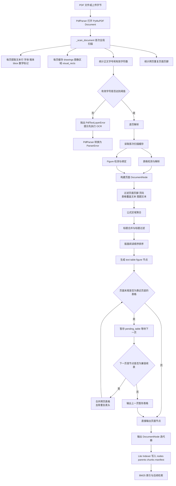
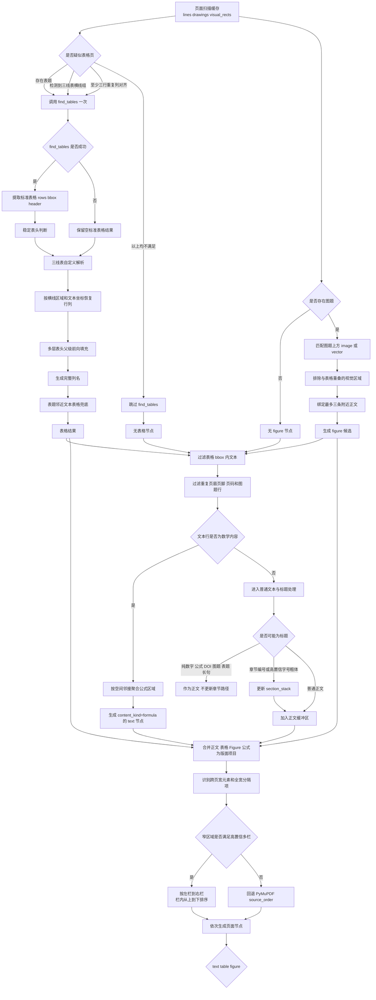

# PDF Parsing Flow

当前实现版本：`pdf_parser_v3` / `layout_order_v2`

核心入口：

- `app/documents/parsers.py::PdfParser`
- `app/documents/pdf_parser.py::iter_pdf_document_nodes`

## 一、端到端主流程



## 二、页面内分支图



## 三、关键分支条件

### 1. OCR 分支

有效字符阈值：

```text
max(4, PDF 页数 * 4)
```

低于阈值时终止解析，不生成空索引，明确提示需要 OCR。

### 2. 表格探测分支

满足任一条件才调用 `Page.find_tables()`：

1. 页面存在 `表 N` 或 `Table N` 表题。
2. drawings 中存在至少三条宽度足够、横向范围高度重叠的平行横线。
3. 非公式短文本中，至少三行具有重复的三列以上横向锚点。

否则完全跳过 `find_tables()`。

### 3. 三线表分支

```text
drawings 横线
  -> 合并同一高度的线段
  -> 按横向重叠聚合横线组
  -> 确定三线表 bbox
  -> 收集 bbox 内文本
  -> 按 y 坐标分行
  -> 按 x 锚点分列
  -> 生成 table 节点
```

### 4. 多层表头分支

只有首行存在空白父级跨度或重复父表头，并且下一行表现为表头时，才按多层表头处理。

示例：

```text
原始第一层：["", "训练集", "", "预测集", ""]
原始第二层：["样品", "Rc", "RMSEC", "Rp", "RMSEP"]

规范化结果：
["样品", "训练集.Rc", "训练集.RMSEC", "预测集.Rp", "预测集.RMSEP"]
```

### 5. 多栏排序分支

启用多栏重排必须同时满足：

1. 候选正文行不少于 4 行。
2. 检测到 2 至 4 个横向栏。
3. 每栏至少包含 2 行。
4. 每栏垂直跨度不少于 24 点。
5. 相邻栏间距不小于 `max(18, 页面宽度 * 0.035)`。
6. 相邻栏垂直重叠比例不低于 45%。

任一条件不满足，回退 PyMuPDF 的 `source_order`。

### 6. 标题分支

以下内容不会进入章节路径：

- 纯数字或数字比例。
- 公式和数学字体内容。
- DOI。
- 图题和表题。
- 长度超过限制或具有明显完整句特征的文本。

通过过滤后，再按章节编号、字号比例和粗体判断标题层级。

### 7. 公式分支

公式识别来源：

- 等号、求和、根号、积分和比较运算符。
- `sqrt()`、`sum()`、`log()` 等函数。
- 数学 Unicode 字符。
- Cambria Math、SymbolMT 等数学字体。

数学行不直接逐行生成节点，而是按垂直距离、水平重叠和中心距离聚合为公式区域。

### 8. Figure 分支

只有检测到图题时才创建 figure 候选：

```text
图题
  -> 查找图题上方的 image/vector
  -> 排除表格重叠区域
  -> 合并视觉 bbox 与图题 bbox
  -> 绑定附近正文
  -> 生成 figure 节点
```

figure 节点保存：

- `caption`
- `nearby_text`
- 页面 `bbox`
- `visual_bbox`
- `caption_bbox`
- `page`
- `figure_index`

### 9. 跨页表格分支

上一页表格只有靠近页底时才暂存。下一页表格必须同时满足：

1. 位于紧邻的下一页。
2. 起始位置位于页面顶部 22% 范围内。
3. 列数相同。
4. 表格宽度差异在允许范围内。
5. 下一页无表头，或规范化表头与上一页一致。

满足条件后：

- 合并 cells。
- 删除下一页重复表头。
- 保存 `page_start`、`page_end` 和 `page_bboxes`。
- 保留第一个 table 节点 ID。

否则输出上一页表格，并将下一页表格作为独立节点。

## 四、节点输出

| 场景 | `node_type` | 关键元数据 |
|---|---|---|
| 普通正文和章节 | `text` | `heading`、`heading_level`、`section_path` |
| 公式区域 | `text` | `content_kind=formula`、`line_count`、`bbox` |
| 表格 | `table` | `headers`、`cells`、`detection_method`、`table_group_id` |
| 跨页表格 | `table` | `cross_page`、`page_start`、`page_end`、`page_bboxes` |
| 图 | `figure` | `caption`、`nearby_text`、`visual_kind` |

## 五、异常与回退

| 异常或低置信度场景 | 当前行为 |
|---|---|
| 无文本层或文字过少 | 中止并提示 OCR |
| `find_tables()` 异常 | 保留三线表和表题文本兜底 |
| 表格页判断为否 | 不调用 `find_tables()` |
| 多栏置信度不足 | 使用 PyMuPDF 原始顺序 |
| 图题没有匹配到视觉对象 | 生成 `caption_only` figure |
| 跨页表格不兼容 | 两页分别生成 table 节点 |
| 旧 PDF 解析器索引 | 要求重建索引 |
